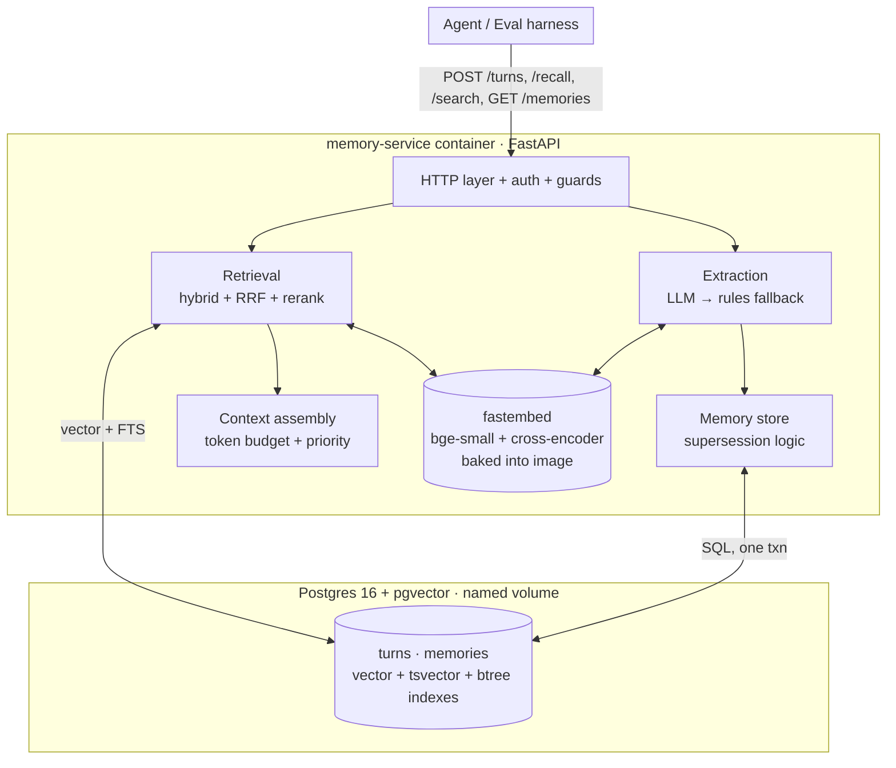

# Memory Service

A memory service for an AI agent. It ingests conversation turns, **extracts
structured knowledge** from them, tracks how facts **evolve and contradict** over
time, and answers **recall** queries that decide what context the agent sees on its
next turn.

Built for the Higgsfield AI Engineering Challenge. One `docker compose up` boots
the service + its store; data survives restarts via a named volume.

```bash
git clone <this repo> memory-service && cd memory-service
docker compose up -d
until curl -sf http://localhost:8080/health; do sleep 1; done
# now POST /turns, POST /recall, ... against http://localhost:8080
```

No API key is required to boot — embeddings/reranking run locally and extraction
falls back to a deterministic engine. Provide an LLM key (see
[`.env.example`](.env.example)) to enable the higher-quality LLM extractor.

---

## 1. Architecture



<details><summary>ASCII fallback</summary>

```
Agent ──HTTP──► FastAPI ──► Extraction (LLM→rules) ──► Memory store (supersession) ──┐
                   │                                                                  │ one txn
                   └──► Retrieval (dense+FTS → RRF → rerank) ──► Context assembly ──► Postgres+pgvector
                              ▲                                       ▲              (named volume)
                              └────────── fastembed (local) ─────────┘
```
</details>

A single FastAPI process owns the whole pipeline; a single **Postgres + pgvector**
database is the only stateful dependency. On `POST /turns`, the service renders the
turn to text, extracts structured memories, embeds everything, and writes the raw
turn plus all derived memories **in one transaction**. On `POST /recall`, it runs
hybrid retrieval, reranks, gates on relevance, and assembles a token-budgeted
context string. Route handlers are synchronous and run in FastAPI's threadpool —
deliberate, since the eval says not to invest in async orchestration and synchronous
code makes the read-after-write guarantee trivial to reason about.

---

## 2. Backing store — Postgres 16 + pgvector

**One store for everything: relational rows, vectors, and full-text indexes.**

Why:

- **Synchronous correctness for free.** Raw turns, extracted memories, embeddings,
  and FTS vectors live in one database, so a `/turns` write commits them in a single
  ACID transaction. There is no second store to fall out of sync — "if you wrote it,
  you can read it" holds with zero extra effort.
- **Hybrid retrieval in one query engine.** pgvector gives HNSW cosine search;
  Postgres `tsvector`/`ts_rank_cd` gives BM25-like lexical search. I need both
  (semantics *and* exact tokens like "Biscuit"), and getting them from one place
  avoids a separate vector DB + keyword store + the glue between them.
- **The data is relational.** Supersession is a foreign-key chain
  (`supersedes`/`superseded_by`), "active fact per key" is an indexed predicate, and
  cleanup is `DELETE ... WHERE user_id = ?`. A graph/relational model fits memory far
  better than a bag of vectors.
- **Boring and reproducible.** The official `pgvector/pgvector:pg16` image + a named
  volume is a two-line compose dependency that any reviewer can run.

The alternative — a dedicated vector DB (Qdrant/Weaviate) — would force a second
store for the relational/supersession data and reintroduce the cross-store
consistency problem the challenge explicitly tests. Not worth it at this scale.

Schema ([`src/memory_service/schema.sql`](src/memory_service/schema.sql)): `turns`
(raw messages + `text_repr` + embedding + generated `tsvector`) and `memories` (typed
key/value + cardinality + provenance + embedding + generated `tsvector` + supersession
links). Indexes: HNSW (cosine) on both embeddings, GIN on both tsvectors, btrees on
`(user_id, key, subject, active)` and session/turn for fast scoping and cleanup.

---

## 3. Extraction pipeline — turning turns into structured knowledge

[`extraction.py`](src/memory_service/extraction.py) →
[`store.py`](src/memory_service/store.py)

The difference between a memory and a log is that I store typed assertions, not
message chunks. Each extracted **memory** has:

| field | meaning |
|---|---|
| `type` | `fact` \| `preference` \| `opinion` \| `event` |
| `key` | canonical dotted topic, e.g. `employment.company`, `location.city`, `pet.dog`, `diet.allergy` |
| `value` | human-readable statement, e.g. "Works at Notion as a PM" |
| `subject` | who it's about (`user` by default) |
| `cardinality` | `single` (one current value) or `multi` (a set) |
| `entity`, `polarity`, `operation`, `is_correction`, `temporal` | supersession + correction signals |
| `confidence`, `source_turn`, `source_session`, `observed_at` | provenance |

**The `key` is the unit of identity.** Two statements about the same attribute must
land on the same canonical key, which is what lets the store detect that one
supersedes the other. The taxonomy ([`taxonomy.py`](src/memory_service/taxonomy.py))
also encodes which keys are set-valued (`pet.*`, `diet.*`, `skill.*` coexist) vs
single-valued (`employment.*`, `location.city` replace).

**Two engines, one interface:**

1. **LLM engine (primary).** A single schema-constrained call (Anthropic or OpenAI)
   reads the turn and emits the JSON above, including **implicit** facts ("walking
   Biscuit this morning" → `pet.dog` = "Has a dog named Biscuit") and corrections.
   This is what runs in the eval (a key is provided).
2. **Rule engine (fallback).** Deterministic regex/heuristics over the user's
   messages — employment, location/move, pets, diet/allergies, family, preferences,
   corrections/retractions. It runs when no key is configured or the LLM call fails,
   so `/turns` **always** produces structured memories and never crashes.

Extraction is synchronous inside the 60 s `/turns` budget.

**What it misses (honestly):** the rule engine cannot infer implicit facts or parse
free-form opinions — that's the LLM's job. Cross-turn coreference ("he" → which
person) is shallow. Numbers/dates inside values are not normalized. The taxonomy is
English-centric. These are deliberate scope cuts, not oversights.

---

## 4. Recall strategy — what the agent sees next

[`retrieval.py`](src/memory_service/retrieval.py) →
[`context.py`](src/memory_service/context.py)

`POST /recall` runs end-to-end:

1. **(Optional) query decomposition.** For multi-hop questions, an LLM rewrites the
   query into 1–3 sub-queries (skipped with no LLM key).
2. **Hybrid first-stage.** For each query, dense (bge-small, cosine/HNSW) **and**
   lexical (Postgres FTS) retrieval over the user's turns; all active memories are
   pulled for the user. Memories are embedded/searched as `"<humanized key>: <value>"`
   (see below).
3. **Reciprocal Rank Fusion** merges the dense and lexical rankings without needing
   score calibration.
4. **Cross-encoder rerank** (ms-marco-MiniLM) rescensions the shortlist jointly over
   (query, passage) and yields the ordering.
5. **Relevance gate** (noise resistance): an item counts as relevant iff
   **cosine ≥ 0.60 OR reranker ≥ 0.008**. If nothing clears the bar, recall returns
   empty context — never a hallucinated profile.
6. **Token-budgeted assembly** by priority (below), formatted as readable Markdown
   with citations.

**The key-prefix trick.** I embed/rerank a memory as `"diet restriction: Is
vegetarian"`, not just `"Is vegetarian"`. A terse value shares no tokens with a
category question ("what dietary restrictions...?"); prefixing the humanized key
turns it into a self-describing passage. Measured on the fixture, this lifted
on-topic cosine from ~0.42 to ~0.78 while leaving noise ≤0.59 — which is what made a
clean noise gate possible. See the CHANGELOG (v0.5) for the full story.

**Why hybrid + rerank, not cosine-top-k.** Pure dense search misses exact-token
queries ("the dog's name?"); pure lexical misses paraphrase. RRF needs no tuning to
combine them, and the cross-encoder is far more precise than either first stage. The
reranker is excellent at *ordering* but compresses short facts into tiny absolute
scores, so the calibrated **cosine** is the primary gate signal — using the right
tool for each job (see CHANGELOG v0.5 for the measurements behind this).

### Priority logic under the token budget

Context is assembled in tiers, filled greedily until `max_tokens` is reached; lower
tiers are truncated or dropped first:

1. **Known facts about the user** — stable identity facts (job, location, family,
   pets, diet) + query-relevant preferences.
2. **Relevant context from earlier conversations** — opinions/events and
   query-relevant turns from the user's *other* sessions, dated.
3. **Recent conversation** — the current session's latest turns, for continuity.

**Defense:** an agent that forgets *who the user is* fails worse than one that forgets
a passing detail, so durable identity gets the first tokens; it's also the cheapest,
densest signal (one line each) and useful for almost any follow-up. Within a tier we
sort by reranker relevance, then confidence, then recency. The budget is estimated
with a calibrated char/word heuristic (no tokenizer dependency — keeps the service
offline-capable; it slightly over-estimates, which is the safe direction for a cap).

### Multi-hop

"What city does the owner of the dog named Biscuit live in?" needs two memories
joined. Because recall is **user-scoped**, the bridging step is implicit: I already
know it's this user, so the location fact is surfaced as stable grounding alongside
the pet fact. LLM query decomposition adds another path for cases that need it.

### Fact evolution in recall

When an active fact supersedes an older one, recall renders the lineage inline:
`- Works at Notion (updated 2025-03-20; previously Works at Stripe)`. The current
value is what's returned; the history is one parenthetical away and fully inspectable
via `/users/{id}/memories`.

---

## 5. Fact evolution, contradictions, corrections

Handled in [`store.py`](src/memory_service/store.py) `apply_candidate`:

- **Single-valued key, new different value** → mark the current row inactive, link the
  two (`supersedes`/`superseded_by`), insert the new value as active. ("Stripe" →
  "Notion".)
- **Multi-valued key** → values coexist; a new value is matched to an existing one by
  `entity`. A correction/update to that item supersedes just that row; a new item is
  inserted alongside. (Two pets, several allergies.)
- **Retraction / negative polarity** ("no longer has a dog") → deactivate the matching
  row; no replacement.
- **Near-duplicate restatement** → refresh `updated_at`/confidence in place; no new
  row, no history churn.
- **In-turn conflict guard** → if a turn both asserts and retracts the same
  single-valued key, the retract is dropped (the assert already supersedes).

Inactive rows are **never deleted**, so the full supersession chain is auditable.

**Opinion arcs (partial, documented).** "I love TypeScript" → "TS generics are
annoying" → "TS is fine for big projects" is modeled as successive supersessions of a
single `opinion.<topic>` stance: the **current** stance is returned and the prior
stances are preserved as the inactive chain with timestamps. What I do *not* yet do is
*synthesize* the trajectory into one nuanced summary ("has cooled on TS but still uses
it") — that would need an arc-aware summarizer over the chain. The data to do it is
all there; the synthesis step is future work.

---

## 6. Cross-session scoping (a deliberate decision)

- **Extracted memories are user-scoped** and shared across all of a user's sessions.
  This is intentional: a memory service exists so the agent remembers across
  conversations. It also matches the smoke test (write in `smoke-1`, recall in
  `smoke-2`, same `user-1` → Berlin).
- **Raw "recent conversation" context is session-scoped** — one session's
  back-and-forth doesn't bleed into another's continuity section.
- **Different `user_id`s are fully isolated.** Concurrent sessions for different users
  never bleed (enforced by `user_id` predicates; covered by `test_concurrent.py`).
- **`user_id` is null** → scope collapses to the single `session_id`.

---

## 7. Tradeoffs

**Optimized for:** recall quality, fact-evolution correctness, synchronous
correctness, and reproducibility. Local embeddings + reranker (baked into the image)
mean retrieval works on a clean machine with **no API key and no network**, and the
rule extractor keeps the service fully functional without an LLM.

**Gave up / deferred:**

- **Async throughput.** Sync handlers + threadpool are simpler and correct for "a few
  concurrent sessions"; not tuned for high QPS.
- **Opinion-arc synthesis** (see §5) and deep multi-hop graph traversal beyond
  user-scoped grounding + query decomposition.
- **Multilingual.** English FTS config + an English embedding model.
- **Learned reranking thresholds.** The gate is calibrated to this reranker/embedder
  on my fixture; a fine-tuned reranker on short facts would let me tighten it.

---

## 8. Failure modes

| Situation | Behavior |
|---|---|
| **No data / cold session** | `/recall` returns `{"context":"","citations":[]}` with 200 — never an error. |
| **Missing API keys** | Extraction uses the deterministic rule engine; embeddings/reranking are local. Fully functional, lower extraction recall on implicit facts. Logged at startup. |
| **LLM error/timeout** | Caught; `/turns` falls back to the rule engine. A flaky LLM never fails a write. |
| **Malformed / oversized / unicode input** | Pydantic → 422; bad JSON → 4xx; >1 MB body → 413 (drained first, clean response); NUL bytes stripped; messages clamped. Service stays up — global handler turns any surprise into a 500, never a crash. |
| **DB still booting at startup** | Schema creation retries with backoff before the pool opens. |
| **Slow disk** | Durability is Postgres's; `/recall` latency is dominated by local embed+rerank (tens of ms on CPU), not disk. Heavy ingest can be batched; not implemented (single service, few sessions). |
| **Restart** | Data is in the named volume; restart is invisible to clients (`scripts/persistence_check.sh`). |

---

## 9. HTTP contract

| Method & path | Purpose |
|---|---|
| `GET /health` | Readiness (200 when DB + models are ready). |
| `POST /turns` | Persist a turn, extract memories, index — synchronous. → `201 {"id"}` |
| `POST /recall` | Token-budgeted context + citations for the next agent turn. |
| `POST /search` | Structured search results (agent tool call). |
| `GET /users/{user_id}/memories` | Inspect the structured memory store. |
| `DELETE /sessions/{session_id}` | Delete a session's data. → `204` |
| `DELETE /users/{user_id}` | Delete all of a user's data. → `204` |

Auth: set `MEMORY_AUTH_TOKEN` to require `Authorization: Bearer <token>` on every
endpoint except `/health`; unset disables auth.

---

## 10. Running the tests

```bash
# 1. boot the service
docker compose up -d
until curl -sf http://localhost:8080/health; do sleep 1; done

# 2. contract + robustness + recall-quality suite (talks to the running service)
uv run pytest -q                      # or: pip install pytest && pytest -q
uv run pytest -s tests/test_recall_quality.py   # see the self-eval report

# 3. self-eval harness on its own (iteration loop)
uv run python tests/harness.py

# 4. restart-persistence (drives docker compose down/up)
RUN_DOCKER_PERSISTENCE=1 uv run pytest tests/test_persistence.py
# or the standalone script:
bash scripts/persistence_check.sh
```

The suite covers: contract round-trip + shapes, immediate read-after-write,
cross-user isolation, malformed/oversized/unicode resilience, the recall-quality
fixture (`fixtures/`, 10 probes across recall / fact-evolution / multi-hop / noise /
isolation), and restart persistence. Tests target `MEMORY_BASE_URL`
(default `http://localhost:8080`) and skip cleanly if no service is up.

---

## 11. Models & configuration

- **Embeddings:** `BAAI/bge-small-en-v1.5` (384-d) via fastembed (ONNX/CPU) — strong
  quality/size for short facts, baked into the image.
- **Reranker:** `Xenova/ms-marco-MiniLM-L-6-v2` cross-encoder — cheap, accurate over
  tens of candidates.
- **Extraction LLM:** Anthropic (default `claude-3-5-haiku-latest`) or OpenAI
  (`gpt-4o-mini`), auto-selected from whichever key is present; override with
  `EXTRACTION_MODEL`. If the model/key is invalid, the service logs a warning and uses
  the rule engine — it never hard-fails a request.

### Environment variables

[`.env.example`](.env.example) is committed **as documentation**; a real `.env` is
**git-ignored and must never be committed**. The service runs with **no `.env` at
all** — `docker compose up -d` works on a clean machine because compose supplies
`${VAR:-default}` for every setting (no mandatory `env_file`).

| Variable | Default | Purpose |
|---|---|---|
| `OPENAI_API_KEY` | _(empty)_ | If set, enables OpenAI extraction. If empty, **rule-based** extraction is used. |
| `OPENAI_MODEL` | `gpt-4o-mini` | OpenAI model, used only when `OPENAI_API_KEY` is set. |
| `ANTHROPIC_API_KEY` | _(empty)_ | Alternative LLM provider (auto-selected if set). |
| `EXTRACTION_PROVIDER` | `auto` | `auto` \| `openai` \| `anthropic` \| `rules`. |
| `MEMORY_AUTH_TOKEN` | _(empty)_ | If set, all endpoints except `GET /health` require `Authorization: Bearer <token>`. If empty, auth is disabled. |
| `DATABASE_URL` | `postgresql://memory:memory@db:5432/memory` | Backing store; compose points it at the bundled Postgres. |
| `PORT` | `8080` | HTTP port. |
| `LOG_LEVEL` | `info` | Log level. |
| `MAX_TURN_BYTES` | `200000` | Max `POST /turns` body size; larger → `413`. |

**OpenAI is optional and only improves extraction/reranking** — the service is fully
functional without it. Enable it locally:

```bash
cp .env.example .env
# then edit .env:
OPENAI_API_KEY=sk-...
```

If `OpenAI` is configured but a request fails, the failure is logged and that turn
falls back to the rule-based engine — the service never crashes.

**Enable auth** by setting a token, then send it on every call:

```bash
# .env
MEMORY_AUTH_TOKEN=some-secret-token
# requests:
curl -H "Authorization: Bearer some-secret-token" http://localhost:8080/recall ...
```

All settings have safe defaults; the centralized config layer is
[`src/memory_service/config.py`](src/memory_service/config.py).

---

## 12. Originality

The design — the canonical-key taxonomy, the cardinality-driven supersession
resolver, the key-prefixed indexing trick, and the cosine-OR-reranker noise gate — is
my own, arrived at by measuring scores on my fixture (see `CHANGELOG.md`). I read
about systems like mem0/Zep for inspiration but lifted no API shape or pipeline.
```
